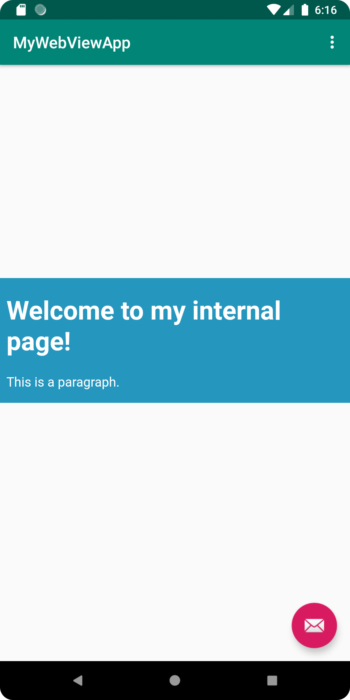

# Rapport

- I renamed the app, created a WebView-element in the layout-file "content_main.xml" and gave it an id.
- I also enabled internet access by adding
```
    <uses-permission android:name="android.permission.INTERNET" />
```
- Created a private variable called of the type 'WebView' and instantiated it in 'onCreate()'
- Enabled JavaScript-execution
```  
    myWebView.getSettings().setJavaScriptEnabled(true);
```
- Added a html page as an asset
- Implemented showExternalWebPage() and showInternalWebPage()
- Called the methods stated above, as shown below:
```
  if (id == R.id.action_external_web) {
    showExternalWebPage();
    Log.d("==>","Will display external web page");
    return true;
  }

  if (id == R.id.action_internal_web) {
    showInternalWebPage();
    Log.d("==>","Will display internal web page");
    return true;
  }
```


## Screenshots


